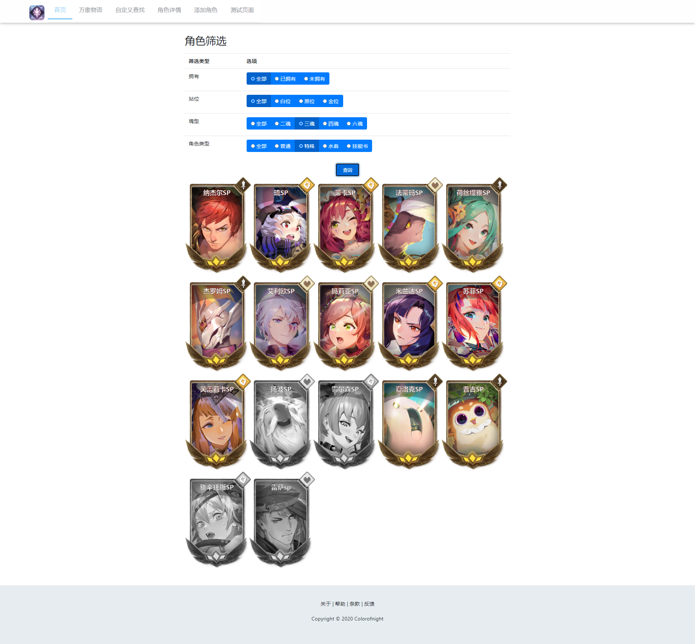
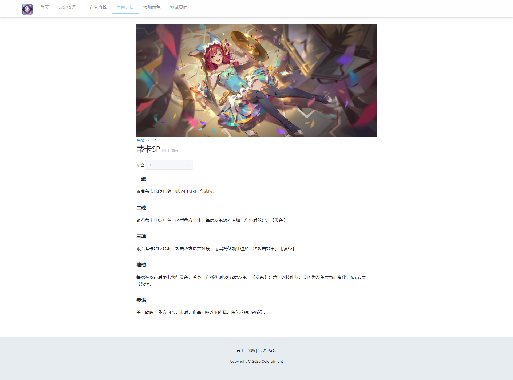

# sdorica-website
> A Vue.js project

[万象物语](http://wxwy.dragonest.com/index/index.html) 小站-前端

网页模板参考[music-website](https://github.com/Yin-Hongwei/music-website)

后端见[万象物语小站前端](https://github.com/colorofnight86/sdorica-server)

## Build Setup

``` bash
# install dependencies
npm install

# serve with hot reload at localhost:8080
npm run dev

# build for production with minification
npm run build

# build for production and view the bundle analyzer report
npm run build --report

# run unit tests
npm run unit

# run e2e tests
npm run e2e

# run all tests
npm test
```

## 运行
双击根目录下的"run server.bat"文件

## 预览
### 主页

### 角色页

